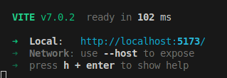

## Interacción con Servidores y Consumo de APIS
- Creación de un programa que realiza operaciones CRUD usando Fetch API.
- Implementación de JSON Server para simular una API que permite gestionar una colección de datos (Productos).
- Validación y manejo de errores.
---
### Funcionalidades sobre los productos
- **GET** --> Obtener todos los productos disponibles.
- **POST** --> Añadir un nuevo producto.
- **PUT** --> Actualizar un producto.
- **DELETE** --> Eliminar un producto. 
---
### Requisitos para iniciar desde la terminal de Visual Studio Code
1. **Activar el servidor** --> npm start
2. **Abrir URL en el navegador** --> Ingresar al Link que aparece en la terminal. En este caso sería: http://localhost:5173/

3. **Interactuar con la página** --> Los resultados apareceran en la consola.

4. **Interactua con la página para ver errores** --> Los errores apareceran en la consola.

